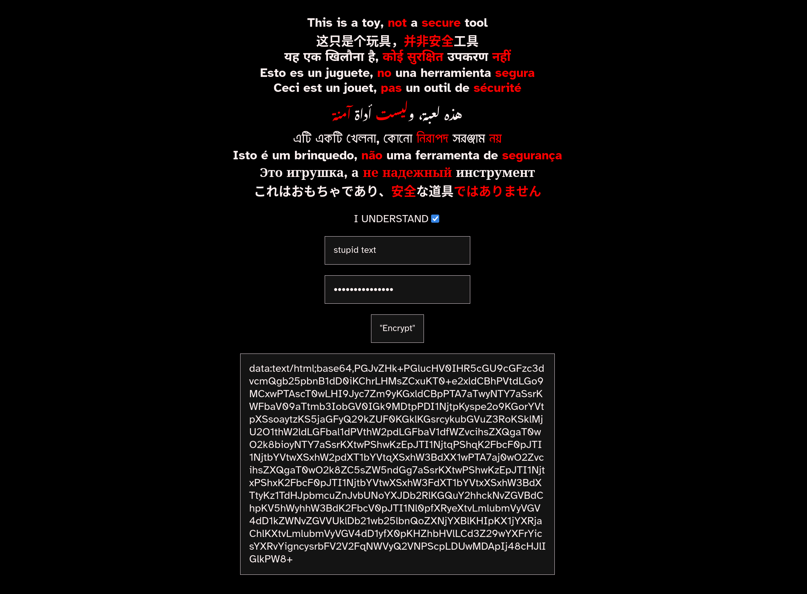

# linkhidetoy
a webtoy *not for sensitive data* that can encrypt text or html snippets in a single password protected data url

it is designed to be used for games and  fun surprises in online social spaces ***not* as a security tool**, it's ecryption method is rudimental and can be brute forced

this code is cc0 public domain
